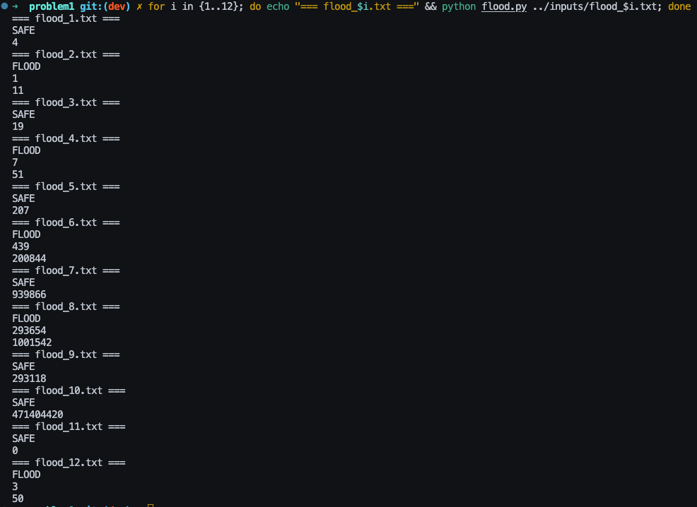
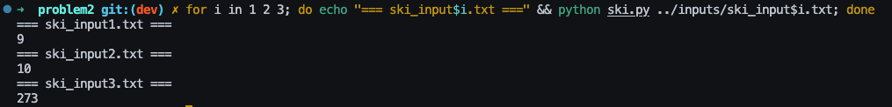

# Problem 1

> Save the village from flooding! The dam is weakening and cracks of different sizes appear at different times. Each time unit, cracks grow larger by 1 unit. You can fix one crack per time unit. Design an algorithm to determine whether the village can be saved or will flood, given a threshold for floodwaters and a drainage rate.
>
> **Output**: "SAFE" with maximum water level reached, or "FLOOD" with the time unit and water level when flooding occurred.


## How to run

From the problem1 dir please run:
```bash
python flood.py <filepath+filename>
```


## Solution Approach

Implement a greedy simulation algorithm using a max-heap priority queue to always fix the largest crack first at each time unit. The simulation tracks floodwater accumulation from unfixed cracks, applies drainage, checks against the threshold, and grows remaining cracks by 1 unit per time step.


### Algorithm Steps

1. Parse the input file to extract the number of cracks `n`, floodwater threshold, drainage rate, and the list of crack specifications (appearance time, initial size).
2. Initialize simulation state: current water level at 0, max heap for unfixed cracks (using negative values), and current time at 0.
3. For each time unit:
   - Add all new cracks appearing at this time to the max heap.
   - Fix one crack by removing the largest crack from the heap (greedy choice).
   - Calculate water inflow from all remaining unfixed cracks and apply drainage, ensuring water never goes below 0.
   - Check if current water level equals or exceeds the threshold; if so, return FLOOD with current time and water level.
   - Grow all remaining cracks by 1 unit (rebuild the heap with incremented sizes).
4. Continue simulation until all cracks are fixed or flooding occurs.
5. If no flooding occurs, return SAFE with the maximum water level ever reached during the simulation.


## Heart of the Algorithm

The solution boils down to one key decision: which crack should we fix right now? The answer is simple—**always fix the biggest crack**. 

Why? Because the biggest crack is pouring the most water into the village at this moment. If we fix it now, we stop that massive flow immediately. If we wait, it grows even larger and floods us faster. Every crack we delay gets bigger by 1 unit each time step, but the already-large cracks hurt us more during that growth period.

We use a max-heap to track unfixed cracks so we can instantly grab the largest one in each time unit. After fixing one and growing the rest, we check if the water level crosses the threshold. The simulation continues until either the village floods or we've fixed all cracks and survived.

This greedy strategy works because there's no strategic advantage to leaving a large crack unfixed—water damage is cumulative and immediate. Fix the worst problem first, every single time.


### Special Cases Handled

- **No cracks**: If `n = 0`, the village is trivially safe with 0 maximum water (handled by early termination).
- **Multiple cracks at same time**: The heap naturally handles simultaneous arrivals; we fix the largest among them.
- **Threshold reached exactly**: The condition `current_water >= threshold` treats equality as flooding, matching the problem specification.
- **High drainage rate**: If drainage exceeds inflow, water stays at 0; the algorithm correctly prevents negative water levels with `max(0, ...)`.


## Example Run




# Problem 2

> You are a downhill skier looking for an adventure. You will be dropped by helicopter as a location of your choosing on a mountain. The mountain is represented as an m x n matric of altitude values. Design an algorithm that determines the longest path you can follow down the mountain such that each successive cell in your path has an altitude lower than the previous cell.
>
> **Note: Each Cell has up to eight neighbors, directly adjacent horizontally, vertically or diagonally.**
>
> Output the longest path to the terminal.


## How to run

From the problem2 dir please run:
```bash
python ski.py <filepath+filename>
```


## Solution Approach

Implement a dynamic programming solution using depth-first search with memoization to find the longest downhill ski path on a mountain represented as an `m × n` matrix. The algorithm explores all possible paths from every cell, considering 8-directional movement (horizontal, vertical, and diagonal), and caches results to avoid recomputation.


### Algorithm Steps

1. Parse the input file to extract dimensions `m` (rows) and `n` (columns), then read the altitude matrix.
2. Initialize a 2D memoization table `dp` where `dp[i][j]` stores the longest path starting from cell `(i, j)`, initially set to `-1` to indicate unvisited cells.
3. Define eight movement directions: up, down, left, right, and four diagonals.
4. For each cell in the matrix, invoke a recursive DFS function that:
   - Returns the cached value if the cell has been visited.
   - Explores all 8 neighbors, recursively computing path lengths for neighbors with strictly lower altitude.
   - Selects the maximum path length among valid neighbors, adds 1 for the current cell, and caches the result.
5. Track the global maximum across all starting positions to find the longest possible path.
6. Output the result as the number of moves (path length minus 1, since the answer counts transitions, not cells).


## Heart of the Algorithm

The algorithm solves the problem by asking a simple question at each cell: "What's the longest path I can ski from here?" The answer depends on the neighbors—if a neighbor is downhill and has already been explored, we can extend that path by one move. If not explored yet, we recursively find out.

The key insight is **memoization**: once we calculate the longest path from a cell, we store it in a cache table so we never recalculate it. Without this cache, the same cells would be explored thousands of times through different routes, making the algorithm impossibly slow. With caching, each of the `m × n` cells is visited exactly once, giving us O(m·n) performance.

The recursion naturally works bottom-up—cells at lower altitudes get computed first because the DFS only follows downhill paths. When we're at a high-altitude cell and check a downhill neighbor, that neighbor either already knows its longest path or will figure it out before returning. This elegant dependency ordering means we don't need to process cells in any special sequence; the recursion handles everything automatically.


### Special Cases Handled

- **Flat or uphill-only regions**: Cells with no downhill neighbors return a path length of 1 (the cell itself), ensuring every position contributes a valid answer.
- **Edge and corner cells**: Boundary checks (`0 <= new_row < m and 0 <= new_col < n`) prevent out-of-bounds access when exploring the 8 directions.
- **Uniform altitude matrices**: If all cells have identical altitude, no downhill moves exist, so the longest path is 0 moves (1 cell minus 1).


## Example Run


