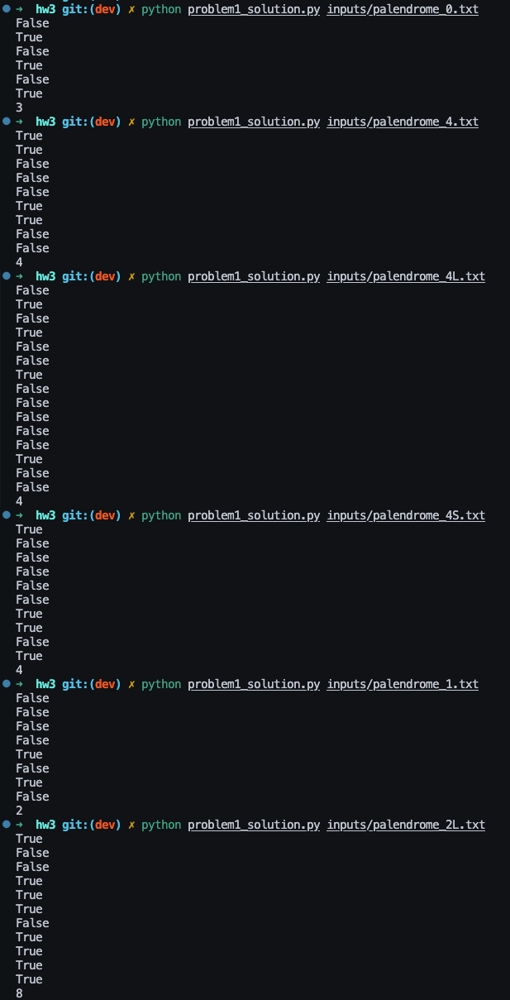
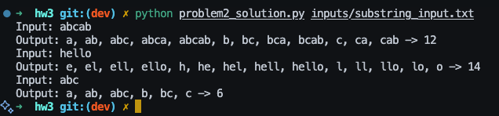
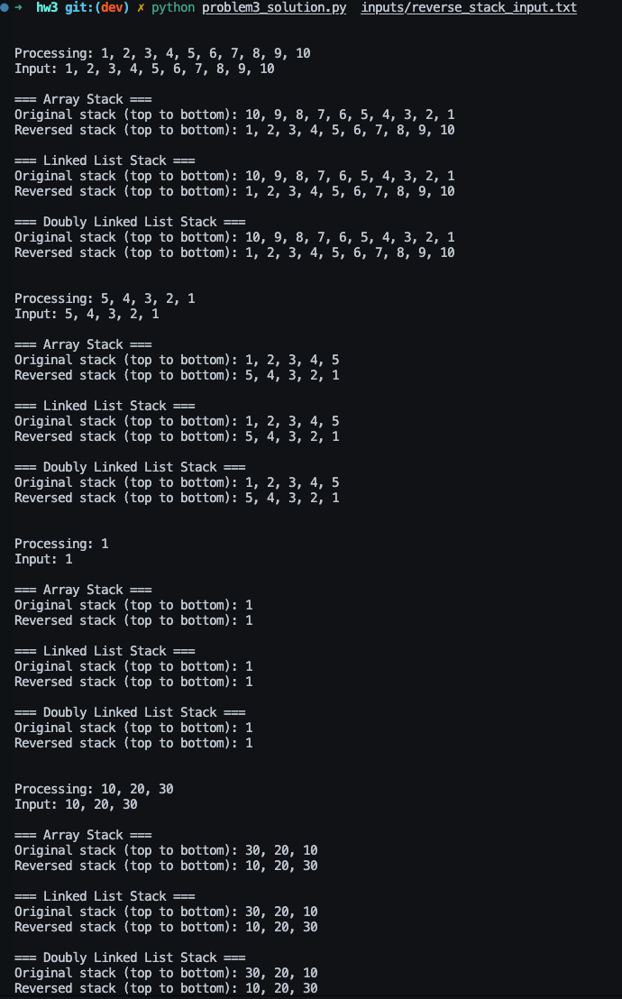
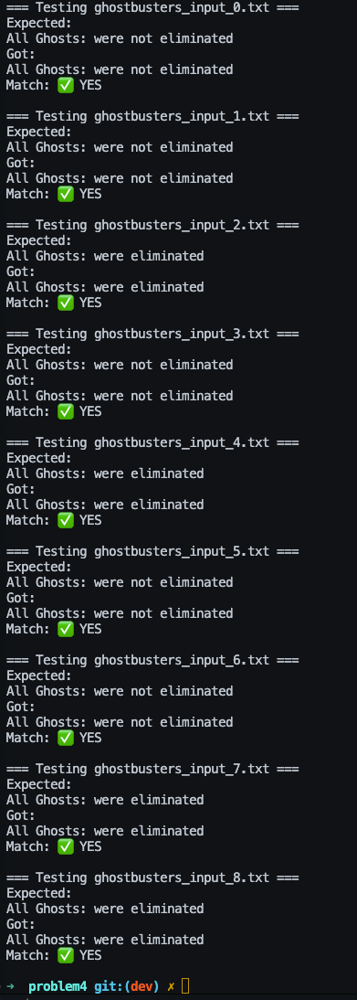

# Problem 1

> Write a program to determine if a given string is a palindrome

Here is a screenshot of the program successfully running the input files provided:

Please see problem1_solution.py for the implementation of the palindrome program.

# Problem 2

> Using recursion create a function that prints and counts the unique set of sub-strings of a given string

Here is a screenshot of the program successfully running a self generated input file:

Please see problem2_solution.py for the implementation of the recursive substring program.

# Problem 3

> Using recursion 
>  - Write a function that reverses a stack implemented as an array
>  - Write a function that reverses a stack implemented as a Linked-list
>  - Write a function that reverses a stack implemented as a doubly linked-list

Here is a screenshot of the program successfully running a self generated input file:

Please see problem3 folder for the implementation of the recursive reverse stack program.

# Problem 4

> A group of n Ghostbusters is battling n ghosts. Each Ghostbuster carries a proton pack which shoots a steam at a ghost destroying it. A stream goes in a straight line in both directions and continues when it hits the ghost. The Ghostbusters decide upon the following strategy:
> - They will pair off with the ghosts, forming n Ghostbuster-ghost pairs and then simultaneously each Ghostbuster will shoot a stream at their chosen ghost. The streams are not allowed to cross so each Ghostbuster must choose a paring for which no streams will cross.
> - You can assume that there are an equal number Ghostbusters and ghosts.

> Create a solution which will determine if all of the Ghosts can be eliminated in a single shot of the Ghostbusters by returning the string “All Ghosts: “ <were|were not> “ eliminated”

Here is a screenshot of the program successfully running a self generated input file:

Please see folder problem4 for the implementation of the ghostbusters program.

