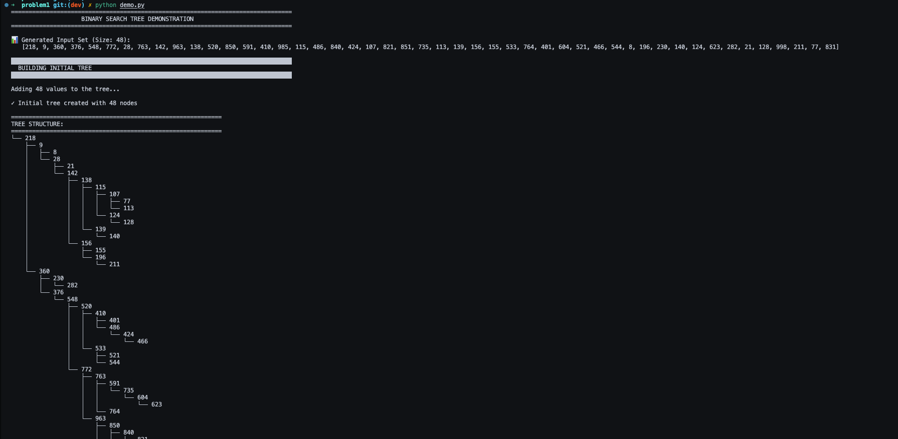
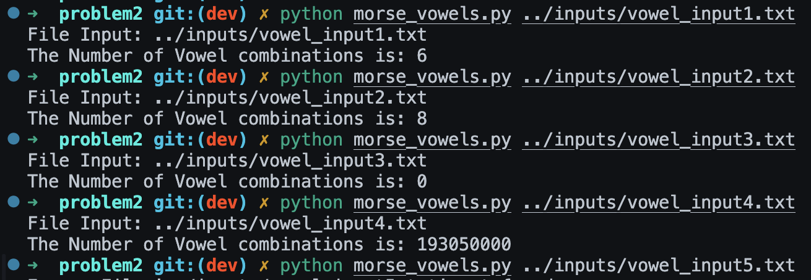
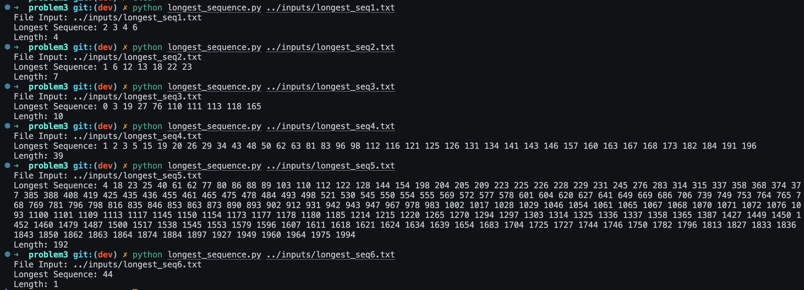

# Problem 1

> Implement a binary search tree 
> Create an ADT for a Node
> Create an ADT for a BST with the following functions:
>  - Add Node(Value)
>  - Delete Node(Value)
>  - FindNode(Value)
>  - PrintTree()

> Demonstrate you code by randomly generating an input set of size 5 to 50 for numbers between 1 and 1000
> You must print out your input set, your initial tree and then exercise your methods add and delete printing your tree after every method invocation. You must also exercise your findNode method by randomly generating a number between 1 and 1000 and printing whether or not you found the node, you must have both positive and negative cases.
> You should submit a readme.txt file with an explanation of your code and algorithms. You must provide exact instructions on how to run your code and you must submit screen shots of your running code.

## How to run

From the problem1 dir please run:
```bash
python demo.py
```

## Solution Approach

A **Binary Search Tree (BST)** is a hierarchical data structure that maintains an ordering property: for any node, all values in its left subtree are smaller, and all values in its right subtree are larger. This property enables efficient O(log n) search, insertion, and deletion operations in balanced trees.

The implementation consists of two Abstract Data Types:

1. **Node ADT**: Represents individual nodes with a value and pointers to left and right children
2. **BinarySearchTree ADT**: Manages the tree structure and provides operations for insertion, deletion, searching, and visualization

The demonstration program generates random input data, builds a tree, and exercises all operations while displaying the tree structure after each modification.


### Algorithm Steps

**1. Add Node (Insertion)**
- Start at the root node
- Compare the value to insert with the current node's value
- If smaller, traverse to the left child; if larger, traverse to the right child
- When reaching a null position, insert the new node there
- Time Complexity: O(h) where h is the height of the tree

**2. Delete Node (Deletion)**
- Locate the node to delete using BST property
- Handle three cases:
  - **Leaf node (no children)**: Simply remove the node
  - **One child**: Replace the node with its child
  - **Two children**: Find the in-order successor (smallest value in right subtree), replace the node's value with the successor's value, then delete the successor
- Time Complexity: O(h) where h is the height

**3. Find Node (Search)**
- Start at the root
- Compare the search value with the current node
- If equal, return True (found)
- If smaller, search the left subtree
- If larger, search the right subtree
- If reach null, return False (not found)
- Time Complexity: O(h) where h is the height

**4. Print Tree (Visualization)**
- Display a visual tree structure using hierarchical formatting
- Show three standard traversals:
  - **In-order** (Left-Root-Right): produces sorted output
  - **Pre-order** (Root-Left-Right): useful for tree copying
  - **Post-order** (Left-Right-Root): useful for tree deletion
- Time Complexity: O(n) to visit all nodes


## Heart of the Algorithm

The core insight of a Binary Search Tree is the **ordering invariant**: for every node N, all values in the left subtree are less than N.value, and all values in the right subtree are greater than N.value. This property allows us to make binary decisions at each node during search, insertion, and deletion, eliminating half of the remaining tree at each step in a balanced tree. All operations follow the same pattern: recursively traverse left or right based on value comparison until reaching the target position or determining the value doesn't exist. The most complex operation is deletion with two children, which uses the in-order successor to maintain the BST property after removal.


### Special Cases Handled

1. **Empty Tree**: All operations check if the tree/subtree is empty (root is None) before proceeding
2. **Single Node Tree**: Deletion properly handles when removing the only node makes the tree empty
3. **Duplicate Values**: The add operation silently ignores duplicate values to maintain unique values in the tree
4. **Leaf Node Deletion**: When deleting a leaf, simply set the parent's pointer to None
5. **One Child Deletion**: Replace the node with its only child, bypassing the deleted node
6. **Two Children Deletion**: Use in-order successor replacement to preserve BST property
7. **Tree Visualization**: Handles null children gracefully when printing the tree structure
8. **Search Termination**: Find operation correctly returns False when reaching null nodes (value not found)


## Example Run



Please see problem1 dir for the implementation of the binary search tree program.


# Problem 2

> Given is a sequence of n symbols, each of which is either a dot (.) or a dash (-). This can represent a sequence of letters in Morse code. However, since the separation between letters is not given, it can represent a number of different sequences. For example, . - - could represent ETT, AT, EM, or W. 
> Design an algorithm that computes the number of possible letter sequences containing only vowels (A,E,I,O,U) that can be derived from a given input sequence of dots and dashes of length n.

> You should submit a readme.txt file with an explanation of your code and algorithms. You must provide exact instructions on how to run your code and you must submit screen shots of your running code. Your code should print the following text:
> ```
> File Input: vowel_input<input file number>.txt
> The Number of Vowel combinations is:  <the number of combinations you calculate>
> ```

## How to run

From the problem2 dir please run:
```bash
python morse_vowels.py <filepath+filename>
```


## Solution Approach

This problem requires counting the number of valid **paths** through a Morse code sequence where each path represents a sequence composed entirely of vowels. The challenge is that without letter separators, a sequence like `....` can be decoded in multiple ways: E-E-E-E, I-E-E, E-I-E, E-E-I, or I-I.

The Morse codes for vowels are:
- **A**: `.-` (2 symbols)
- **E**: `.` (1 symbol)
- **I**: `..` (2 symbols)
- **O**: `---` (3 symbols)
- **U**: `..-` (3 symbols)

This is a problem with the following characteristics:
- **Optimal substructure**: The number of ways to decode a sequence up to position i depends on the number of ways to decode smaller subsequences
- **Overlapping subproblems**: The same positions are revisited multiple times when checking different vowel possibilities

The solution builds a DP table where `dp[i]` represents the total number of valid vowel-only sequences that can decode the first i characters of the input.


### Algorithm Steps

**1. Initialize DP Array**
- Create array `dp[0...n]` where n is the length of the Morse sequence
- Set `dp[0] = 1` (base case: empty sequence has one way to decode - no letters)
- Set all other positions to 0

**2. Iterate Through Each Position** (i from 1 to n)
- For each position i, try to match each of the 5 vowels ending at that position
- Check if we have enough preceding characters to form each vowel

**3. Match Vowels at Current Position**
For each vowel with Morse code of length L:
- Extract substring `sequence[i-L : i]`
- If substring matches the vowel's Morse code:
  - Add `dp[i-L]` to `dp[i]`
  - This adds all the valid paths that reached position `i-L` (they can now extend by adding this vowel)

**4. Return Final Result**
- `dp[n]` contains the total number of valid vowel-only decodings for the entire sequence

**Example**: For sequence `....` (4 dots)
```
Position:  0    1    2    3    4
Sequence:      .    ..   ...  ....
dp values: 1    1    2    3    5

At position 4:
- E matches (last 1 char): add dp[3] = 3
- I matches (last 2 chars): add dp[2] = 2
- Total: dp[4] = 5
```


## Heart of the Algorithm

The core insight is the **diagonal summation principle**: at each position i in the sequence, we look back along a "diagonal" to find all positions where a vowel could start such that it ends at position i. When a vowel of length L matches at position i, we add all the paths that reached position `i-L` because each of those paths can be extended by appending this vowel. This avoids exponential recursion by storing intermediate results in the DP array. Instead of exploring all possible decodings recursively (which would be O(5^n)), we build the solution bottom-up in O(n×5) time by reusing previously computed path counts. The key DP transition is: `dp[i] = sum of dp[i-L]` for all vowels of length L that match at position i.


### Special Cases Handled

1. **Empty Sequence**: Returns 0 (no characters means no vowel sequences possible)
2. **No Valid Decodings**: If no vowels can match at a position, `dp[i]` remains 0, correctly propagating through the rest of the sequence
3. **Single Vowel Only**: Sequences that only match one vowel pattern (like `---` only matches O) correctly return 1
4. **All Dots**: Sequences of only dots can be decoded in many ways using E (1 dot) and I (2 dots) - handles Fibonacci-like growth
5. **Multiple Vowel Matches**: At any position, multiple vowels might match (e.g., at position 2 of `..`, both E and I match), correctly summing all possibilities
6. **Sequence Length Validation**: Verifies the input sequence length matches the specified n value from the file
7. **No Vowel Paths**: Sequences containing patterns that can't form vowels (like a single dash `-`) correctly return 0


## Example Run



Please see problem2 dir for the implementation of the morse code program.

# Problem 3

> You are given two sequences of integers: A = {a1, a2, …. ai} and B = {b1, b2, …. bj}.
> Define an algorithm that returns the longest sequence of alternating increasing values from A and B where the sequence X = {x1, x2, …. xn} is as follows:
> - The elements of X are increasing e.g. xi < xi+1 for all 1 <= i < n
> - The odd-indexed elements of X are a subsequence of one of the sequences either A or B and the even-indexed elements of X are a subsequence of the other sequence.
> - Note a subsequence need not be consecutive elements of the original sequence but must maintain the relative order of the original sequence
>
> For example A = {1,7,2} and B = {4,8,3,9} then the answer is X = {4,7,9} which has a length of 3.


## How to run

From the problem3 dir please run:
```bash
python longest_sequence.py <filepath+filename>
```

## Solution Approach

This problem requires finding the longest **strictly increasing subsequence** that alternates between two arrays while respecting a critical constraint: **synchronized index movement**. When picking an element at index `i` from one array, the next element from the other array must come from index `j ≥ i+1`.

The key challenge is the index synchronization constraint:
- If you pick `A[i]`, you can only pick from `B[j]` where `j ≥ i+1` and `B[j] > A[i]`
- If you pick `B[j]`, you can only pick from `A[k]` where `k ≥ j+1` and `A[k] > B[j]`

This differs from a standard longest alternating subsequence because indices move forward in lockstep between the arrays, not independently.

The problem exhibits:
- **Optimal substructure**: The longest sequence starting at position i can be computed from the longest sequences starting at later positions
- **Overlapping subproblems**: The same positions are evaluated multiple times when exploring different starting points

The solution uses **memoization** to efficiently compute the longest sequence from each possible starting position, then reconstructs the optimal path.


### Algorithm Steps

**1. Two-Pass Strategy**
- Call algorithm twice: once starting with array A, once starting with array B
- Return the longer of the two results
- This ensures we explore both possible alternation patterns

**2. Compute DP Values (Memoized Recursion)**

For each position in array A:
```
dp_from_a(i):
  - Base: sequence starting at A[i] has length at least 1
  - For each B[j] where j ≥ i+1 AND B[j] > A[i]:
      - Recursively compute: length_from_b = dp_from_b(j)
      - If (1 + length_from_b) > current_best:
          - Update best_length
          - Remember j as the next jump position
  - Memoize: (best_length, next_index, 'B')
  - Return memoized result
```

For each position in array B:
```
dp_from_b(j):
  - Base: sequence starting at B[j] has length at least 1
  - For each A[k] where k ≥ j+1 AND A[k] > B[j]:
      - Recursively compute: length_from_a = dp_from_a(k)
      - If (1 + length_from_a) > current_best:
          - Update best_length
          - Remember k as the next jump position
  - Memoize: (best_length, next_index, 'A')
  - Return memoized result
```

**3. Find Best Starting Position**
- After computing all DP values, scan all `dp_from_a(i)` entries
- Select the index i with maximum sequence length

**4. Reconstruct the Sequence**
- Start from the best starting position
- Follow the "next_index" pointers stored in the DP table
- Alternate between arrays A and B
- Append each value to the result sequence
- Stop when next_index = -1 (no valid extension exists)

**Example**: For A = [1, 7, 2], B = [4, 8, 3, 9]
```
Starting from B[0]=4:
  - Can jump to A[1]=7 (index 1 ≥ 0+1, value 7 > 4) ✓
  - From A[1]=7, can jump to B[3]=9 (index 3 ≥ 1+1, value 9 > 7) ✓
  - From B[3]=9, no valid A[k] where k ≥ 4
  - Result: [4, 7, 9], length = 3
```


## Heart of the Algorithm

The core insight is the **synchronized index constraint**: unlike standard subsequence problems where you can jump to any later position in an array, here the position in one array directly constrains which positions are available in the other array. This creates a coupling between the two arrays that makes greedy approaches fail—you must explore all valid paths to find the optimal solution.

The algorithm uses **memoized recursion with parent pointers** to avoid exponential blowup. Instead of exploring all possible sequences (which could be exponential), we:
1. Store the best sequence length from each position (memoization prevents recomputation)
2. Remember which next position to jump to (parent pointers enable reconstruction)
3. Build the solution bottom-up by solving subproblems from right to left

The DP transition is: `dp[i] = 1 + max(dp[j])` for all valid j positions in the other array where the index and value constraints are satisfied. Time complexity is **O(n×m)** where n and m are the array lengths, as each position is computed once and examines at most O(m) or O(n) candidate next positions.


### Special Cases Handled

1. **Empty Arrays**: Returns empty sequence if either array A or B is empty
2. **No Valid Extensions**: When no element in the other array satisfies both index and value constraints, the sequence terminates with length 1
3. **All Single-Element Sequences**: If no valid alternations exist (e.g., all elements in one array are smaller than all in the other, but indices don't align), returns a sequence of length 1
4. **Synchronized Index Boundary**: Correctly handles when at position i, requiring the other array index to be ≥ i+1, preventing index overflow
5. **Both Alternation Orders**: Tries starting with both array A and array B, ensuring the optimal solution is found regardless of which array begins the sequence
6. **Memoization Prevents Re-computation**: Each position's DP value is computed exactly once, avoiding exponential time complexity
7. **Tie-breaking**: When multiple sequences have the same length, the algorithm returns the first one found (deterministic behavior)
8. **Value Equality**: Strictly increasing constraint (>) correctly rejects equal values, preventing non-increasing sequences


## Example Run



Please see problem3 dir for the implementation of the longest sequence of alternating increasing values program.