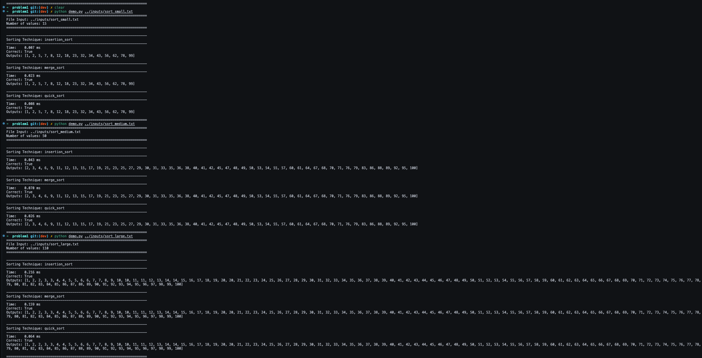
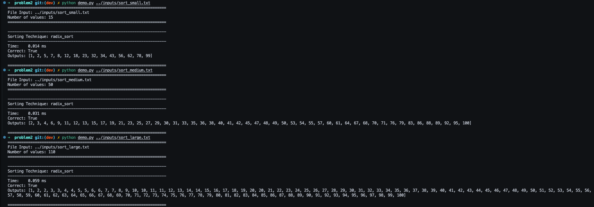
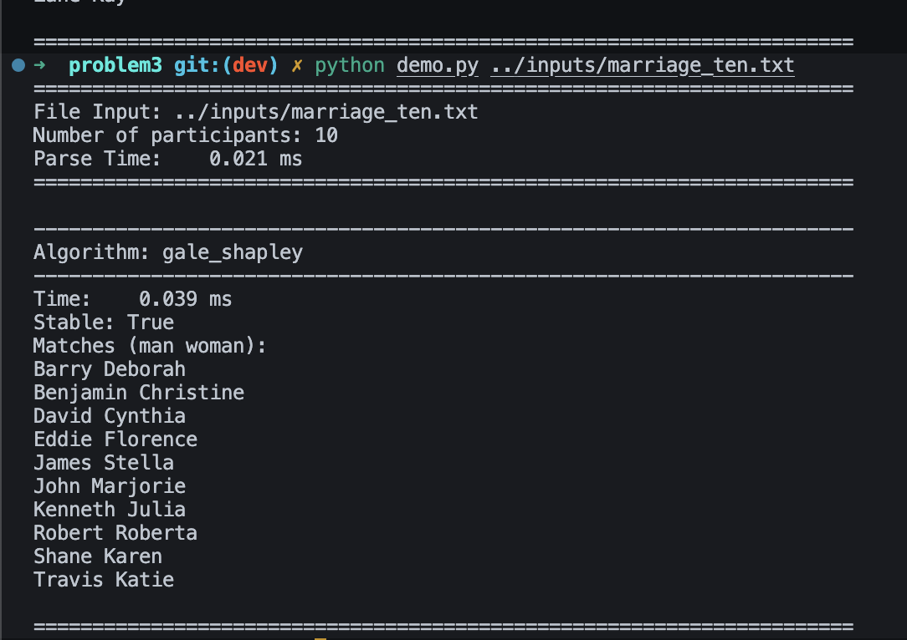
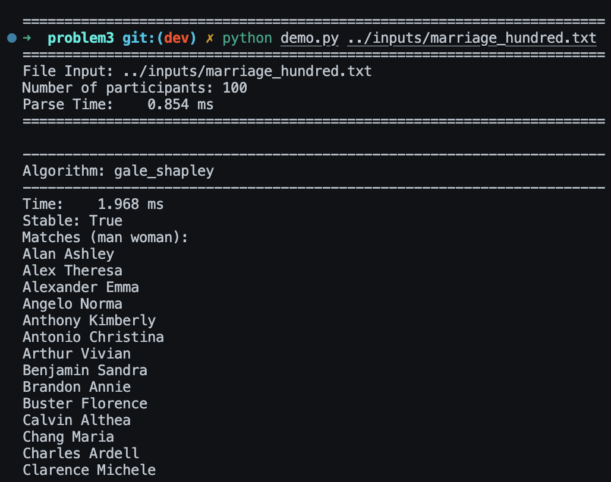
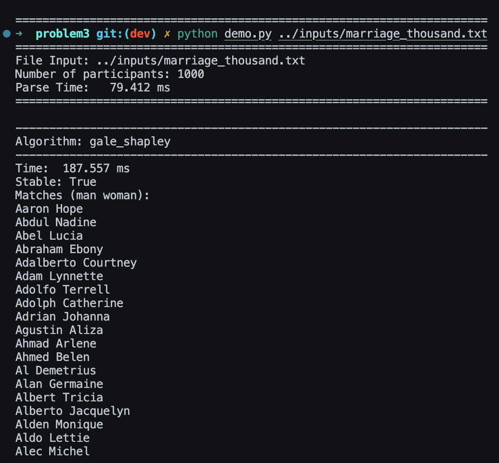

# Problem 1

> Implement the following sorting algorithms:
>  - Merge Sort
>  - Quick Sort
>  - Insertion Sort


## How to run

From the problem1 dir please run:
```bash
python demo.py <filepath+filename>
```


## Solution Approach

Problem 1 implements three comparison-based sorts—Insertion, Merge, and Quick in separate modules (`insertion_sort.py`, `merge_sort.py`, `quick_sort.py`). Each function operates on a defensive copy of the input list so the algorithms can be benchmarked independently.


### Algorithm Steps
1. Read integers from the provided input file into a Python list.
2. Pass a copy of that list to `insertion_sort`, which iteratively inserts each element into the growing sorted prefix using swaps.
3. Pass a fresh copy to `merge_sort`, which recursively halves the list until length-one sublists remain, then merges them in linear time.
4. Pass another copy to `quick_sort`, which performs a Lomuto-style partition around a midpoint pivot and recurses on the partitions.
5. For each algorithm, time the execution, verify the result with `sorted`, and print the status banner plus the first and last five numbers from the sorted list.
6. Repeat for any additional datasets supplied on stdin.


## Heart of the Algorithm

The core of each algorithm stays faithful to the textbook version while keeping the code readable:
- `insertion_sort` walks the array once, bubbling the current element leftward until it lands in the sorted prefix; a simple while-loop handles the swaps without extra storage.
- `merge_sort` drives recursion through a `split -> conquer -> merge` sequence where the merge step uses two indices and appends the lesser value until one half exhausts.
- `quick_sort` partitions the array around the middle element chosen as pivot to reduce worst-case risk on nearly sorted inputs; a helper `partition` maintains a `store_index` to swap smaller values forward.


### Special Cases Handled

- Empty input files: the driver detects the absence of data and prints a warning instead of crashing.
- Duplicate values: all implementations treat duplicates as ordinary numbers, preserving stability in insertion/merge while acknowledging quick sort’s potential instability.
- Non-integer tokens: the parser guards the `int` conversion and raises a descriptive error so malformed files fail fast.


## Example Run



Please see problem1 dir for the implementation of the quick, merge, and insertion sort algorithms.


# Problem 2

> Research and Implement a Radix Sort


## How to run

From the problem2 dir please run:
```bash
python demo.py <filepath+filename>
```


## Solution Approach

Radix sort lives in `radix_sort.py` and follows an LSD (least-significant-digit) strategy over base-10 digits. The wrapper function copies the incoming list, splits it into non-negative and negative numbers, and feeds each bucket through the same digit pipeline so that signed values remain supported. The helper `_lsd_radix` iterates across digit positions, invoking a stable counting sort for every exponent.


### Algorithm Steps

1. `demo.py` reads the target file, splitting on whitespace to build a list of integers.
2. Partition the list into non-negative and negative values, flipping the sign on negatives to reuse the same digit routine.
3. For each bucket, compute the maximum magnitude and iterate over decimal exponents from 1, 10, 100, ... until the highest digit is processed.
4. On each exponent, call `_counting_sort_by_digit` to perform a stable counting sort keyed by the current digit.
5. After all passes, reverse the sorted negative bucket (after restoring the sign) and concatenate it with the sorted non-negative bucket.
6. Emit timing, correctness, and a preview of the sorted output so datasets of varied sizes can be compared consistently.


## Heart of the Algorithm

At the center of the radix pipeline is the guarantee of **stability** delivered by the digit-wise counting pass. For each exponent we bucket occurrences of the current base-10 digit, convert those counts into prefix sums, and then replay the input in reverse so that ties retain their prior ordering. Chaining these stable passes from least to most significant digit lets earlier decisions “bubble forward,” producing the same order as a full numerical comparison while running in O(d·(n+b)) time (digits × elements × base). Treating negative numbers as sign-flipped positives keeps the digit math simple and then restores the natural ordering during the final concatenation.


### Special Cases Handled

- Empty files: the reader returns an empty list and the demo prints zero-length output without error.
- Negative integers: handled by sign-flipping into the LSD pipeline and reordering after sorting.
- Large magnitudes: arbitrary-length integers merely increase the number of digit passes, leveraging Python’s unbounded int support.


## Example Run



Please see problem2 dir for the implementation of the radix sort algorithm.


# Problem 3

> You are building a dating web service. There are an equal number of men and women. Implement the gale-shapley algorithm to assign the best dates for the given input. The algorithm mush match the men and women such that no date is unstable.
> - Every man ranks the women in order of preference
> - Every woman ranks the men in order of preference
> - Each man proposes a date to the woman he most prefers
> - Each woman either considers the date requests she receives and replies “maybe” to the man she likes best and “no” to all the rest
> - As long as there are unmatched men, each man proposes a date to the most preferred woman to whom he has not yet proposed a date too regardless of whether or not she is already matched
> - Each woman reviews the new proposals and either replies “maybe” if she is not yet matched or if she prefers this new man to the one she was previously matched to she rejects her previous date and accepts the new request


## How to run

From the problem3 dir please run:
```bash
python demo.py <filepath+filename>
```


## Solution Approach

Stable matching logic lives in `gale_shapley.py`. The parser reads the shared preference file, builds dictionaries for men and women, and validates that every list is a full permutation. The Gale-Shapley implementation lets the men propose, tracks which woman each man will approach next, and maintains a ranking map so women can quickly decide between their current match and a new suitor. The `demo.py` harness mirrors the other problems: it loads the file, times the solver, verifies stability, and prints a concise preview of the matches.


### Algorithm Steps

1. Parse the participant count, then read `n` male and `n` female preference rows, trimming whitespace-only lines.
2. Build preference dictionaries and ranking maps for constant-time comparisons while guarding against duplicate or missing names.
3. Initialize every man as free with a pointer to the first woman on his list.
4. While free men remain, allow each to propose to the next woman on his list; women keep the best proposal seen so far and reject less-preferred suitors.
5. Collect the final engagements as man→woman pairs and record them in sorted order for reporting.
6. Run a stability check to confirm no blocking pairs exist before printing results alongside runtime metrics.


## Heart of the Algorithm

The Gale-Shapley loop maintains stability by always letting the woman choose between her current partner and any new proposal using her ranked preference map. Because proposals monotonically move down each man’s list and women only trade up, the process terminates in at most `n²` iterations. The additional validation step replays the definition of instability to ensure the produced matching satisfies the problem constraints.


### Special Cases Handled

- Sparse files: blank lines are ignored, and missing data raises descriptive errors.
- Invalid preferences: duplicate participants or lists that omit opponents trigger explicit `ValueError`s instead of silent failures.
- Large cohorts: the algorithm remains efficient for the provided 1,000 participant dataset thanks to the O(n²) bound and lightweight bookkeeping.


## Example Run





