# Problem 1

> Implement the Huffman Encoding Algorithm we went over in class.


## How to run

From the hw7 dir please run:
```bash
python huffman_encode.py <filepath+filename>
```

```bash
python huffman_decode.py <filepath+filename>
```


## Solution Approach

Huffman encoding is implemented across three modules: `huffman_tree.py` contains the core tree-building logic and node structures, `huffman_encode.py` reads plaintext files and produces compressed binary output with metadata, and `huffman_decode.py` reconstructs the original text from the compressed format. The encoder builds a frequency map from the input, constructs a Huffman tree using a min-heap, generates variable-length codes through tree traversal, and writes the encoded bit stream to a binary file alongside a JSON metadata file containing the frequency map. The decoder reverses the process by reading the metadata to rebuild an identical tree, then walking the tree bit-by-bit to recover each character until the entire message is restored.


### Algorithm Steps

**Encoding Process:**
1. Read the input text file and build a frequency map counting occurrences of each character.
2. Create leaf nodes for each character and insert them into a min-heap priority queue ordered by frequency.
3. Build the Huffman tree by repeatedly extracting the two smallest nodes, creating a parent with combined frequency, and reinserting until one root remains.
4. Traverse the tree assigning binary codes: '0' for left branches, '1' for right branches, accumulating the path from root to each leaf.
5. Encode the original text by replacing each character with its Huffman code and concatenating into a bit string.
6. Convert the bit string to bytes (padding to 8-bit boundaries), write to a `.huffman` file, and save the frequency map as `.huffman.meta` JSON.

**Decoding Process:**
1. Read the compressed `.huffman` file into a byte array and the `.huffman.meta` JSON to retrieve the frequency map and padding information.
2. Rebuild the Huffman tree from the frequency map using the same construction algorithm as encoding.
3. Convert bytes back to a bit string and remove padding bits.
4. Walk the tree: start at root, read each bit (0=left, 1=right), emit the character when reaching a leaf, then return to root and continue.
5. Repeat until all bits are consumed, verifying the decoded length matches the original.
6. Write the reconstructed text to the output file.


## Heart of the Algorithm

The core insight of Huffman encoding is simple: **give short codes to common characters, long codes to rare ones**. The algorithm builds a binary tree from the bottom up by repeatedly pairing the two least-frequent items. Start with individual characters as leaves, combine the two smallest into a parent node whose frequency is their sum, and repeat until only one root remains. Reading the path from root to each leaf—0 for left, 1 for right—produces that character's code. Because we always merged the smallest pairs first, frequent characters naturally end up closer to the root with shorter paths, while rare characters sink deeper with longer paths. The beauty is that no code can be a prefix of another, so during decoding we can walk the tree bit-by-bit without needing delimiters: when we hit a leaf, output that character and restart from the root. This greedy construction runs in O(n log n) time using a min-heap, encoding takes O(m) for m characters, and decoding also runs in O(m) by following one tree edge per bit.


### Special Cases Handled

- **Empty files**: The encoder detects empty input and exits with an error message instead of attempting to build a tree.
- **Single unique character**: When the tree has only one node, the code defaults to "0" to avoid an empty code, and decoding multiplies that character by the bit count.
- **Padding**: The bit string is padded to the nearest 8-bit boundary before writing; the metadata records the padding length so the decoder can strip it during reconstruction.
- **Unicode characters**: All text is read and written with UTF-8 encoding, preserving characters beyond ASCII (e.g., café, 東京).
- **Metadata validation**: The decoder verifies that the decoded character count matches the original length stored in metadata, catching corruption or implementation bugs.
- **File not found**: Both encoder and decoder check for missing input files and print helpful error messages with usage instructions.


## Example Run

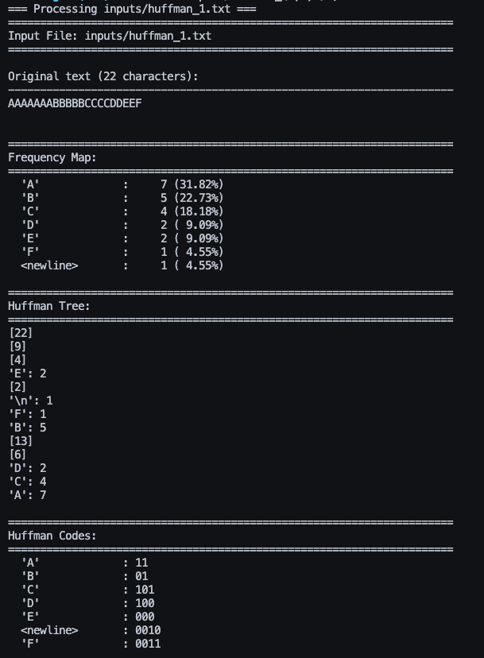
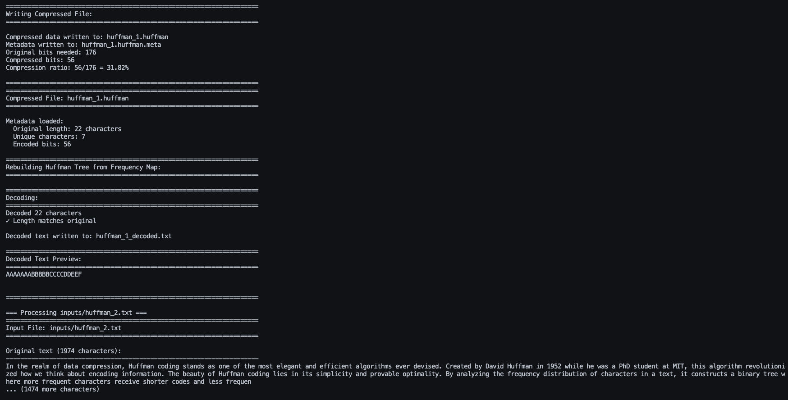
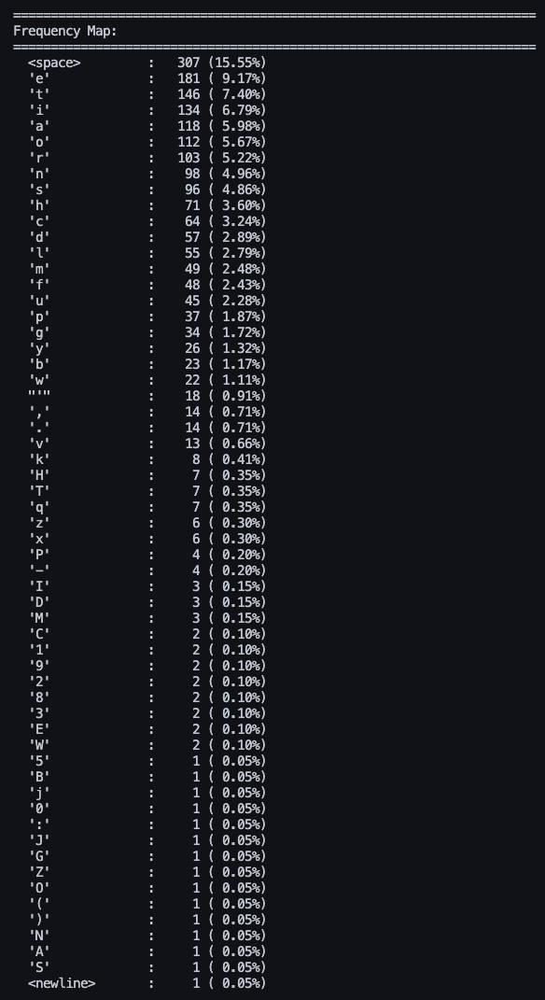
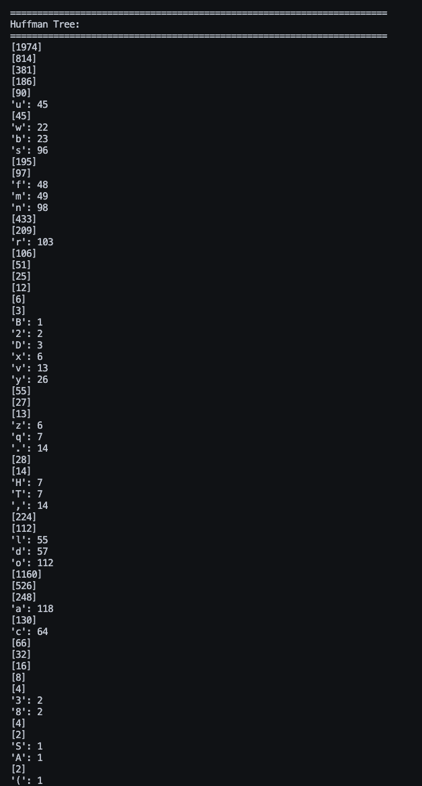
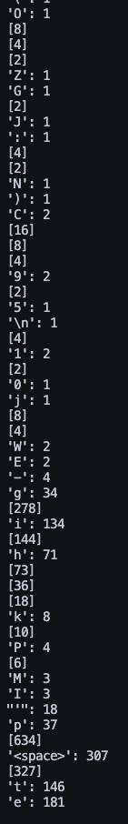
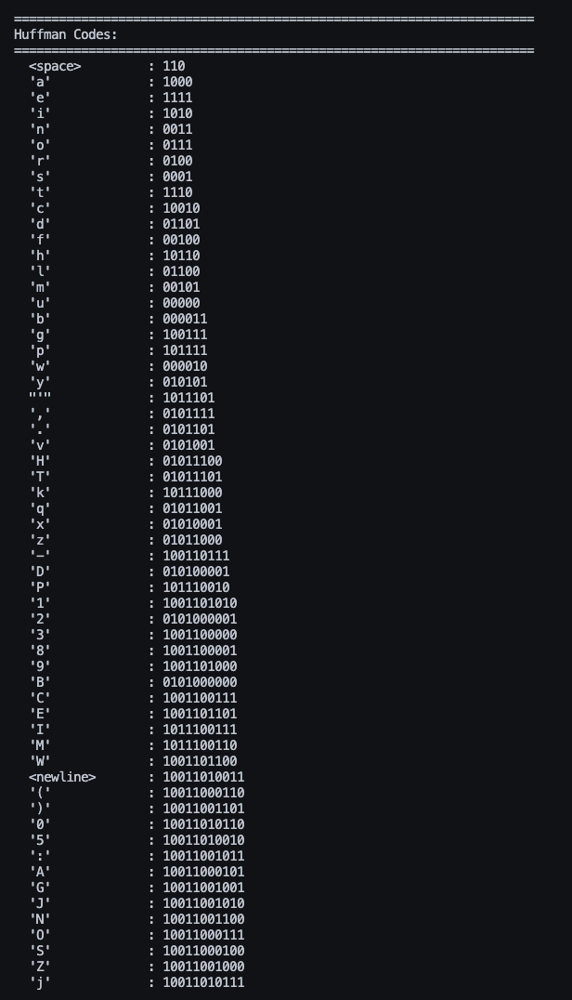
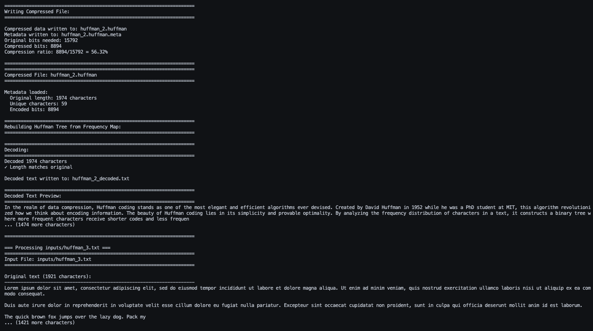
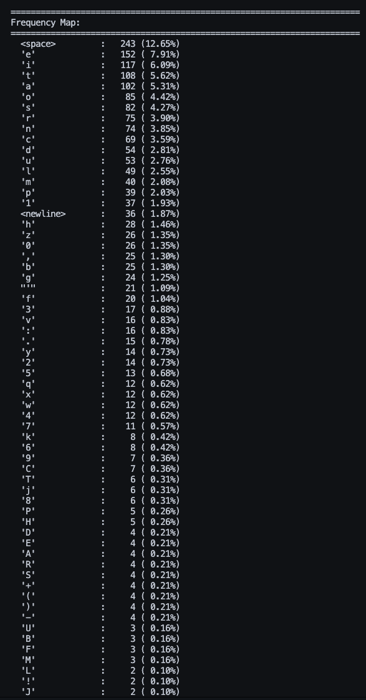
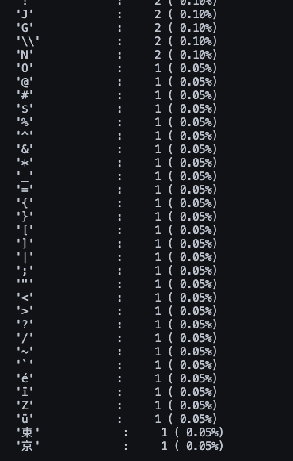
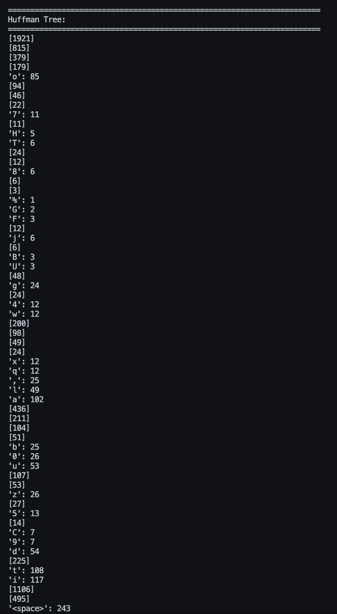
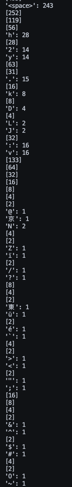
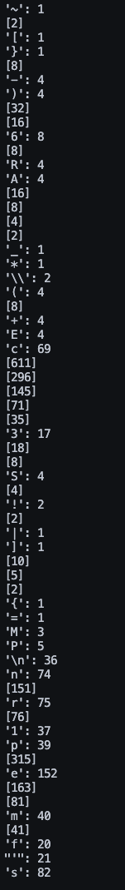
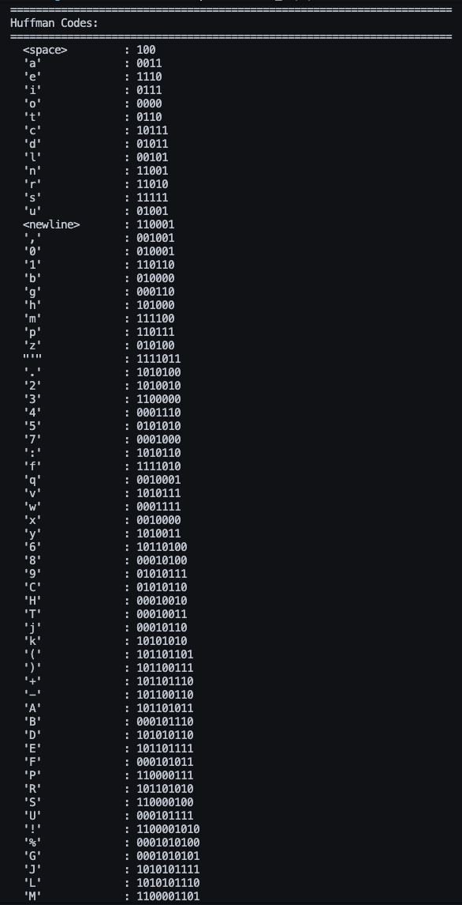
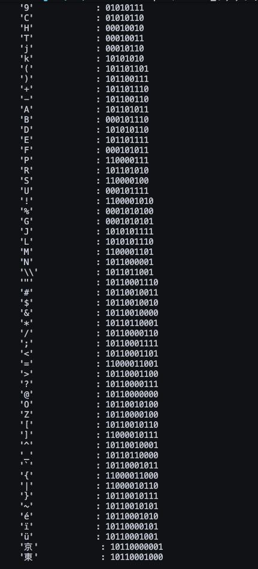
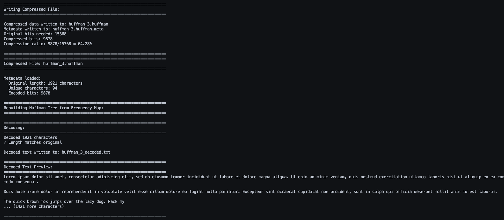


