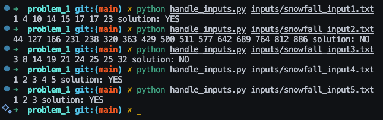
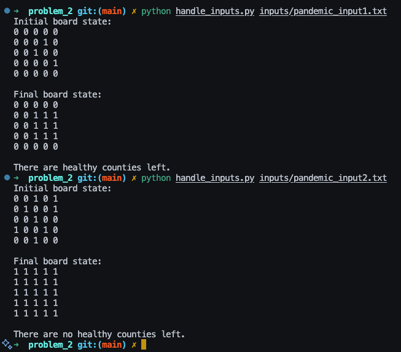
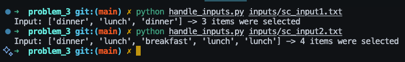
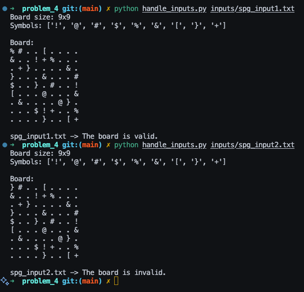

# Problem 1 - Snowfall

## Solution Approach

The problem requires determining if there exists a period of three consecutive days where the total snowfall exceeds half of the total snowfall recorded across all days. The input data contains cumulative snowfall totals, so the first step is to convert these to daily snowfall amounts.

The approach involves:
1. Converting cumulative snowfall data to daily snowfall amounts
2. Calculating the target threshold (half of total snowfall)
3. Using a sliding window technique to check all possible 3-day periods
4. Returning "Yes" if any 3-day period exceeds the threshold, "No" otherwise

### Algorithm Steps

1. **Parse Input**: Read the number of days and cumulative snowfall data from the input file
2. **Convert to Daily Amounts**: Transform cumulative data to daily snowfall amounts:
   - First day: `snowfall_data[0]`
   - Subsequent days: `snowfall_data[i] - snowfall_data[i-1]`
3. **Calculate Target**: Set target as `snowfall_data[-1] / 2` (half of total snowfall)
4. **Sliding Window Check**: For each possible starting position:
   - Sum snowfall for 3 consecutive days
   - If sum > target, return "Yes"
5. **Return Result**: If no 3-day period exceeds target, return "No"

## Heart of the Algorithm

The core algorithm uses a sliding window approach to efficiently check all possible 3-day periods by iterating through each valid starting position. For each window, it sums exactly 3 consecutive days of snowfall data and compares against the target threshold of half the total snowfall.

### Special Cases Handled

- **Input Validation**: Ensures the input file contains the correct number of data points
- **Boundary Checking**: Loop termination prevents array index out-of-bounds errors
- **Edge Case**: Arrays with fewer than 3 days are handled by the loop condition
- **Zero Snowfall Days**: Algorithm correctly handles days with no snowfall (0 inches)

## Example Run

Please see problem_1 dir for the implementation of the snowfall program.

# Problem 2 - Pandemic

## Solution Approach

The problem simulates the spread of a pandemic across a grid of counties to determine if any healthy counties will remain after the infection has fully spread. The simulation uses cellular automaton principles where each county's state in the next time step depends on its current state and the states of its immediate neighbors.

The approach involves:
1. Creating an initial board state with infected and healthy counties based on input coordinates
2. Iteratively simulating the spread where healthy counties become infected if they have 2 or more infected neighbors
3. Continuing simulation until no more changes occur (steady state reached)
4. Determining if any healthy counties remain after the simulation completes

### Algorithm Steps

1. **Parse Input**: Read board size and coordinates of initially infected counties from input file
2. **Initialize Board**: Create n×n grid with 0 (healthy) and 1 (infected) based on input coordinates
3. **Simulation Loop**: Repeat until no changes occur in a round:
   - For each healthy county, count infected neighbors (up, down, left, right)
   - If 2 or more neighbors are infected, mark county as infected in next state
   - Update board to new state and check if any changes occurred
4. **Final Assessment**: Check if all counties are infected or if healthy counties remain

## Heart of the Algorithm

The core algorithm uses a cellular automaton approach with a two-buffer system to simulate pandemic spread in discrete time steps. Each healthy county becomes infected only when it has at least 2 infected neighbors among its 4 cardinal directions, ensuring controlled spread dynamics.

### Special Cases Handled

- **Boundary Checking**: Validates neighbor coordinates are within grid bounds before checking infection status
- **State Isolation**: Uses separate current and new board states to prevent cascading updates within a single time step
- **Convergence Detection**: Tracks board changes to determine when simulation reaches steady state
- **Edge Counties**: Properly handles counties at grid edges that have fewer than 4 neighbors

## Example Run

Please see problem_2 dir for the implementation of the pandemic program.

# Problem 3 - Shopping Cart

## Solution Approach

The problem requires finding the maximum number of items that can be collected from aisles using only 2 baskets, where each basket can hold only one category of item. The shopper can choose any starting aisle and must collect items from left to right until reaching an aisle with a category that cannot be placed in either basket.

The approach involves:
1. Trying every possible starting position in the aisle array
2. For each starting position, simulating the shopping process with 2 baskets
3. Collecting items greedily from left to right until forced to stop
4. Tracking the maximum number of items collected across all possible starting positions

### Algorithm Steps

1. **Parse Input**: Read the number of aisles and comma-separated category names from input file
2. **Initialize Variables**: Set max_items to 0 to track the best result
3. **Try All Starting Positions**: For each possible starting index:
   - Initialize two empty baskets (dictionaries to track categories and counts)
   - Set items_collected counter to 0
4. **Simulate Shopping**: From starting position to end of aisles:
   - Try to place current item in basket 1 (if empty or contains same category)
   - If not possible, try basket 2 (if empty or contains same category)
   - If neither basket can accept the item, stop shopping for this starting position
5. **Update Maximum**: Track the highest number of items collected across all attempts

## Heart of the Algorithm

The core algorithm uses a brute force approach that tries every possible starting position and greedily collects items until forced to stop. For each starting position, it maintains two baskets and attempts to place each item in the first available compatible basket, stopping when a third category is encountered.

### Special Cases Handled

- **Empty Baskets**: Algorithm correctly handles initial placement of items in empty baskets
- **Single Category Aisles**: Properly handles cases where all aisles contain the same category
- **Two Category Optimization**: Efficiently uses both baskets to maximize collection when exactly two categories are present
- **Early Termination**: Stops collection immediately when encountering a third incompatible category

## Example Run

Please see problem_3 dir for the implementation of the shopping cart program.

# Problem 4 - Symbol Puzzle Game

## Solution Approach

The problem requires validating a symbol puzzle board (similar to Sudoku) to determine if it follows the constraint rules. The board must be n×n where n is a perfect square. The validation checks that each symbol appears at most once in every row, column, and √n × √n sub-board.

The approach involves:
1. Validating board dimensions
2. Checking row-wise uniqueness for all symbols
3. Checking column-wise uniqueness for all symbols  
4. Checking sub-board uniqueness within each √n × √n region
5. Returning validation result based on constraint satisfaction

### Algorithm Steps

1. **Parse Input**: Read board size, symbol list, and n×n grid from input file
2. **Dimension Validation**: Verify n is a perfect square
3. **Row Validation**: For each row, ensure no symbol appears more than once
4. **Column Validation**: For each column, ensure no symbol appears more than once
5. **Sub-board Validation**: For each √n × √n sub-board:
   - Extract all cells within the sub-board boundaries
   - Ensure no symbol appears more than once within the sub-board
6. **Return Result**: "The board is valid." if all constraints pass, "The board is invalid." otherwise

## Heart of the Algorithm

The core algorithm uses three separate constraint validation passes over the board to check Sudoku-like rules. Each validation uses a set to track seen symbols and detect duplicates, with early termination when the first violation is found.

### Special Cases Handled

- **Perfect Square Validation**: Ensures board dimensions allow for equal-sized sub-boards
- **Empty Cell Handling**: Skips validation for cells marked with '.' (empty positions)
- **Sub-board Boundary Calculation**: Correctly maps linear indices to 2D sub-board regions using integer division

## Example Run

Please see problem_4 dir for the implementation of the symbol puzzle game.
